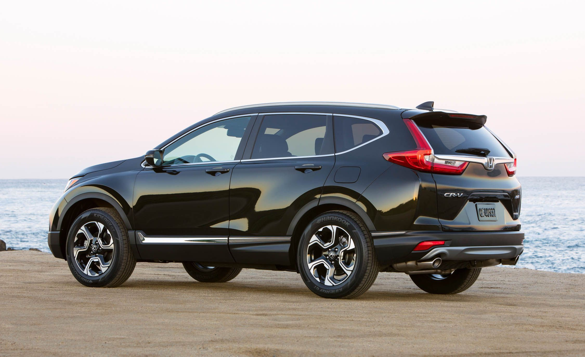

# 2018 Honda CR-V Manual
\

## Table of Contents
- [Introduction](#Introduction)
- [Description](#Description)
- [Installation](#Installation)
- [Instructions](#Instructions-for-Use-of-Car)
- [FAQ](#FAQ)
- [Troubleshooting](#Troubleshooting)
- [Contribution](#Contribution)

## Introduction
The 2018 Honda CR-V is on of the top picks for compact SUV rankings and is 5th in the most common car amoungst American's.  This car has quality cabin materials, lots of seating and seating space, great cargo space, great safety score, great handling, and a capable engine.\
\
**Features** 
- 5 seats
- 21-28 mpg in the city
- 31-34 mpg on highway
- FWD and AWD
- 184-190 Horsepower

## Description
**[Back to Top](#2018-Honda-CR-V-Manual)**\
This document will help you use your 2018 Honda CR-V efficiently and help you discover any features you wish to, learn what a feature is, and/or show you a feature you never knew it had.\

## Installation
**[Back to Top](#2018-Honda-CR-V-Manual)**
1. Buy or own a 2018 Honda CR-V.
2. Have a valid drivers liscense for the car.
3. Have a valid registration for the car.
4. Have the starter key for the car.

## Instructions for Use of Car
**[Back to Top](#2018-Honda-CR-V-Manual)**\
**Must read all instructions before use.**
1. Unlock and step into driver seat of 2018 Honda CR-V.
2. Put the ignition key into the ignition slot.
3. Turn the key to the third position and hold for a second.
4. Let the key go back into position two.
   - Note: Now the car is running and you can proceed with any number of processes.
5. Consult the next 3 sections ([Center Console](#Center-Console), [Steering Wheel](#Steering-Wheel), and [Dash](#Dash)) to learn what features you want to use next.
6. Look at the [Center Console](#Center-Console) for options on how to change the display's settings, the AC, parking break, automatic break hold system, and the Econ mode.
7. Look at the [Steering Wheel](#Steering-Wheel) for control over the car and the ability to change some of the display settings remotely.
8. Look at the [Dash](#Dash) in order to see how your car is running.
9. When finished pressing buttons and turing knobs continue to "9." otherwise go back to "4." to figure out what you want to do next.
10. Push the gearshift into Park.
11. Rotate the key counter-clockwise into position 1.
12. Remove the key from the car.
13. Leave and lock the 2018 Honda CR-V with the key.

- [Center Console](#Center-Console)
- [Steering Wheel](#Steering-Wheel)
- [Dash](#Dash)

### Center Console
**[Back to Top](#2018-Honda-CR-V-Manual)**\
For all three of the [Top](#Top-Panel), [Middle](#Middle-Panel), and [Lower](#Lower-Panel) panel you should just push the button unless otherwise noted.\

#### Top Panel
**T1**: Changes brightness setting, either day or night mode.\
**T2**: Changes The center display to the radio.\
**T3**: Switches between medias: bluetooth, ipod, and radio.\
**T4**: Rotate clockwise/counter-clockwise to increase/decrease volume repectively.  Push to turn the center display on/off.\
**T5**: Changes radio station or changes song on bluetooth or ipod device.\
**T6**: Changes radio station or changes song on bluetooth or ipod device.\
**T7**: Accepts/declines phone call.\
**T8**: Press to select the sound setting mode.\
**T9**: Rotate clockwise/counter-clockwise to scroll through choices.  Push to set your selection\
**T10**: Opens the menu where you can change settings or the time on your clock.\
**T11**: Used on menus to go back.
#### Middle Panel
**M1**: Rotate knob clockwise/counter-clockwise to decrease/increase AC temperature.  Push to change AC to auto mode.\
**M2**: Circulate air.\
**M3**: Bring in new air.\
**M4**: Activate front windshield heaters.\
**M5**: Activate rear windshield heaters.\
**M6**: Change where the air is coming out.\
**M7**: Turn AC on/off.
#### Lower Panel
**B1**: Activate parking break.\
**B2**: Turns on/off automatic break hold system.\
**B3**: Gearshift: Push button on left size and move up and down to switch gears.\
**B4**: Turn on/off fuel efficient mode.

### Steering Wheel
**[Back to Top](#2018-Honda-CR-V-Manual)**\

#### Right side
**R1**: If cruise control is off do nothing. If cruise control is on and if cruise control is enabled then increase speed, else reset to last set speed.\
**R2**: When cruise control is on, disables/enables cruise control.\
**R3**: If cruise control is off do nothing. If cruise control is on and if cruise control is enabled then decrease speed, else set to current speed.\
**R4**: Turn on/off cruise control.
#### Left Side
**L1**: Decrease Volume.\
**L2**: Same as left arrow on center console.\
**L3**: Accepts a call.\
**L4**: Increase Volume.\
**L5**: Changes the source.\
**L6**: Same as right arrow on center console.\
**L7**: Ends/Decline call.\
**L8**: Press to mute/unmute the phone connected.
#### Middle
Push the middle of the steering wheel to honk.

### Dash
**[Back to Top](#2018-Honda-CR-V-Manual)**\

#### D1: Oil pressure guage
Shows the oil pressure in your car.
#### D2: Rpm Dectector
Shows the rpm's (rotations per minute) that you car's engine is currently running at.
#### D3: Speedometer
Shows the speed that your car is currently running at.
#### D4: Fuel Gage
Shows you how much fuel you have.

##  FAQ
**[Back to Top](#2018-Honda-CR-V-Manual)**
- Does this manual work for any other car?\
This definetly does not work for any other car.  Some parts may be similar but it would be best to view the right manual for the right car.
- Does this manual work for a different year Honda CR-V?\
Maybe, but it would be best to view the right maual for the car as some parts in a newer/older model may be moved around.

## Troubleshooting
**[Back to Top](#2018-Honda-CR-V-Manual)**\
If there are any problems with your 2018 Honda CR-V, please visit your local mechanic or use the contact info below.\
Friendship Honda of Boone: (828)-264-6006

## Contribution
The souce README for this manual is located [here](https://github.com/fravelhm/ENG3695Proj2/blob/main/README.md).\
The official manual for the 2018 Honda CR-V is located [here](http://techinfo.honda.com/rjanisis/pubs/OM/AH/ATLA1818OM/enu/ATLA1818OM.PDF).\
You may also contact hmfravel@gmail.com with any further questions.\
**[Back to Top](#2018-Honda-CR-V-Manual)**

